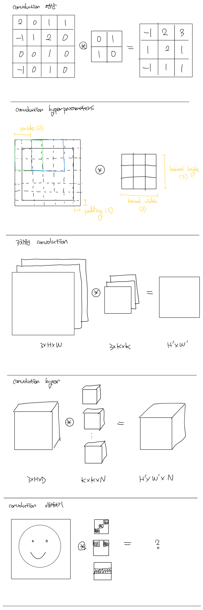
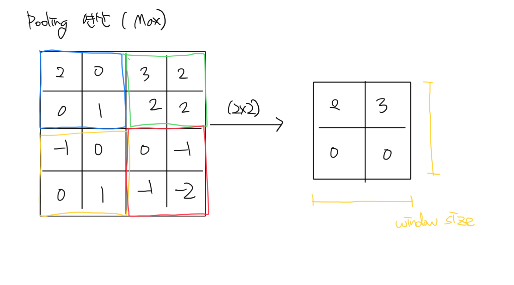

# 10주차: 학습 기법과 합성곱 신경망

## 1. 학습 기법

### 1.1. Optimizer
신경망 학습의 가장 큰 목표는 손실값을 최소화할 수 있는 매개변수(파라미터, 웨이트)값을 찾아내는 것이었고, 지난 주에는 손실값의 편미분값으로 매개변수를 조정하는 방법으로 SGD를 사용했다.

하지만 이러한 SGD 기법에는 단점이 있는데, 바로 방향에 따라 기울기의 경향성이 크게 변하는 비등방성 함수에 대해서는 탐색 경로가 매우 비효율적이라는 것이다.

이러한 단점을 극복하기 위한 optimizer로 Momentum, AdaGrad, Adam과 같은 것들이 있다.

**1.1.1. Momentum Optimizer**  
매 배치에서의 기울기값을 파라미터 업데이트에 가해지는 힘으로 간주하고, 그 힘에 의한 속도만큼 파라미터를 갱신하겠다는 개념.

$$
v = \alpha v - \eta \frac{\partial{L}}{\partial{W}}
\\ \ \\
W = W + v
$$

**1.1.2. AdaGrad(Adaptive Gradient) Optimizer**  
많이 움직인(불안정한?) 방향에 대해서는 학습률을 점차 줄여나감으로써 더 빠르고 안정적인 학습을 만들겠다는 개념.

$$
h = h + \frac{\partial{L}}{\partial{W}} * \frac{\partial{L}}{\partial{W}}
\\ \ \\
W = W - \eta \frac{1}{\sqrt{h}}\frac{\partial{L}}{\partial{W}}
$$

**1.1.3. Adam Optimizer**  
AdaGrad + Momentum. 가장 많이 쓰인다. 프로젝트를 진행할 때, 일단 Adam으로 때려박고 보는 편!

$$
h = h + \frac{\partial{L}}{\partial{W}} * \frac{\partial{L}}{\partial{W}}
\\ \ \\
v = \alpha v - \eta \frac{1}{\sqrt{h}} \frac{\partial{L}}{\partial{W}}
\\ \ \\
W = W + v
$$

### 1.2. 가중치의 초깃값
가중치(weight, 파라미터, 매개변수)의 초깃값을 정하는 것도 나름대로 중요한 문제이다.
- 가중치를 모두 0으로 초기화하면, 학습이 제대로 진행되지 않는다.
- 가중치가 너무 작거나 너무 크면, 역시 학습이 진행되지 않는다. (기울기 소실 문제)
- 각 layer의 활성화값들이 고르게 분포되어야 신경망의 표현력이 극대화된다.

**1.2.1. Xavier 초기화**  
활성화 함수가 선형인 것을 전제로, 앞 계층의 노드(출력값의 수)가 n개라면, 표준편차가 $1/\sqrt{n}$ 이고 평균이 0인 정규분포로 파라미터를 초기화함. 이 때 sigmoid 함수나 tanh 함수는 0 근처에서 선형이라고 가정함.

**1.2.2. He 초기화**  
ReLU에 특화된 초기화값으로, $2/\sqrt{n}$ 인 표준편차를 사용함.

### 1.3. 배치 정규화
배치 정규화는 2015년에 구글에 의해 제안된 딥러닝 발전사 내 마일스톤격의 방법이다! 현재는 거의 모든 신경망 구조에 필수적으로 사용되며, 다음과 같은 아주 중요한 효과를 가진 것으로 알려져있다. (이것 말고도 다른 효과도 있다고 주장하는 논문들도 많다.)
- 더 빠른 학습
- 파라미터 초깃값의 영향력 감소 (더 안정적인 학습)
- 오버피팅 억제

아이디어는 다음과 같다.
- 각 layer의 input 값들의 분포가 학습 과정에서 변화하는 현상을 covariate shift라 부른다.
- 이러한 covariate shift는 학습을 방해한다. 모델의 파라미터가 계속해서 이렇게 변화하는 분포에 맞게 학습되어야 하기 때문.
- 하지만 covariate shift는 신경망의 층이 깊어질수록 나비효과처럼 커진다. 첫 번째 layer의 학습이 이루어지면 이로 인해 두 번째 layer의 input distribution이 변하고, 그러면 세 번째 layer의 input distribution은 더 크게 변하고, ...
- 이로 인해 학습이 매우 길어지는 등 여러 문제가 발생함!
- 그러니 이러한 covariate shift를 없애기 위해, 매 layer에서 input value의 distribution을 고정해버리자!

이와 같은 아이디어에 따라 BatchNorm은 배치 단위로 input 데이터의 각 차원의 평균이 0, 분산이 1이 되도록 정규화한다.

$$
\hat{x}^{(k)} = \frac{x^{(k)} - E[x^{(k)}]}{\sqrt{Var[x^{(k)}]}}
$$

하지만 이렇게 되면 모델의 표현력을 지나치게 제한할 수 있다. 이에 BatchNorm layer마다 각각의 차원이 고유한 평균과 분산을 가질 수 있도록, 평균을 위한 파라미터 $\gamma$ 와 분산을 위한 파라미터 $\beta$ 를 두어 학습하도록 한다.

$$
y^{(k)} = \gamma^{(k)} \hat{x^{(k)}} + \beta^{(k)}
$$

통상적으로는 이러한 BatchNorm layer를 Affine layer (혹은 Convolution layer)와 activation (e.g. ReLU) layer 사이에 삽입한다.

*내가 공부하며 썼던 논문 리뷰: [링크](https://iam.jesse.kim/8a9ec5e3-6ae1-42c6-9dfb-fe3464046c7f)*

### 1.4. 오버피팅
지난 시간에 오버피팅의 개념을 소개한 적이 있다!

이러한 오버피팅은 이론적으로는 데이터에 비해 너무 높은 표현력의(너무 짱짱센) 모델을 사용할 때 나타난다. 즉,
- 데이터가 너무 적어서, 학습되지 않은 데이터에도 강건한 모델을 만들 수 없거나
- 과도하게 깊은 신경망을 사용해서, 모델이 학습 데이터 하나 하나를 전부 학습해버렸거나

직관적으로 오버피팅은 신경망 혹은 신경망의 파라미터가 데이터의 어느 한 가지 특성에만 과도하게 집중하여 학습되었다고 해석할 수 있다. 저번 검정 배경의 고양이, 노랑 배경의 강아지 비유에 따르면, 모델이 배경에만 너무 몰두해버린 것!

이러한 오버피팅을 방지하기 위한 방법들은 정말로 여러가지가 있는데, 대표적인 것들은...

**1.4.1. weight decay**  
신경망이 어느 한 가지 특성에만 과도하게 집중했을 때 나타나는 현상 중 하나는, 특정 파라미터의 값이 과도하게 커지는 것이다.

따라서 각 파라미터의 값이 너무 커지지 않게 방지해줌으로써 오버피팅을 억제할 수 있는데, 이를 위한 하나의 방법이 loss 값에 각 파라미터 값의 제곱을 더해주는 것이다. 이를 weight decay라 부른다.

$$
\hat{L} = L + \frac{1}{2} \lambda W^2
$$

**1.4.2. dropout**  
신경망이 어느 한 가지 특성, 혹은 어느 한 가지 파라미터에만 집중하는 것을 방지하는 또 하나의 방법이 바로 dropout이다. Dropout layer에서는, 입력값의 각각의 차원을 일정 확률로 삭제 - 즉 0으로 - 한다.

통상적으로 학습할 때에만 이러한 dropout을 적용하며, 실제로 추론을 진행할 때는 적용하지 않는다. 그리고 dropout을 진행했을 때, output의 distribution이 변하는 것을 방지하기 위해 삭제한 만큼의 비율을 전체 값에 곱해주기도 한다.

어이없지만 굉장히 효과 좋은 오버피팅 방법 중 하나이며, 이게 이론적으로 Bayesian framework랑 관련이 있다는 (그래서 오버피팅을 잘 잡아주는 거라는) 논문들도 간혹가다가 있다.

**1.4.3. image augmentation**  
또 하나의 효과적인 오버피팅 방지 방법은 image augmentation으로, 학습 시에 이미지마다 랜덤한 변형을 가해주는 것이다. 양옆으로 반전하거나, 색조를 조금씩 바꿔주거나, 살짝 기울이거나, 랜덤 노이즈 값을 더해주거나, ... 아주 다양한 방법이 있다!

### 1.5. 하이퍼파라미터 최적화
살펴봤듯 신경망 학습에는 아주 많은 하이퍼파라미터 - 사람이 직접 손으로 정해줘야 하는 파라미터들을 하이퍼파라미터라고 부른다 - 가 존재한다.
- 신경망의 구조 (깊이와 너비)
- 학습률
- weight decay 파라미터
- dropout 확률
- image augmentation의 종류와 정도
- Optimizer의 파라미터들
- ...

일반적으로 사용하는 값들이 정해져있는 경우도 있고, 손수 바꿔가며 실험해봐야 하는 경우도 있다! 하이퍼파라미터 탐색은 운 + 경험.

## 2. 합성곱 신경망

### 2.1. 완전연결 계층의 단점
이미지 처리에 있어서 완전연결 계층(linear layer, 혹은 affine layer)은 비효율적이다.
- 가까이 있는 픽셀과 멀리 있는 픽셀을 동등하게 계산함.
- 아무리 멀리 있더라도, 모든 픽셀의 조합을 계산해야 함.

하지만 인간이 이미지를 해석하고 사물을 인식/인지하는 매커니즘을 생각해보면, 위치상 인접한 픽셀들의 관계가 더 중요함을 알 수 있다. 이에 따라 위와 같은 비효율을 해소하기 위해 제안된 방법이 바로 convolution layer.

### 2.2. 합성곱 연산
무려 예전에 소개한 적이 있다!

*과제: convolution layer 구현하기*

### 2.3. 풀링 연산
CNN 모델의 연산량을 줄이기 위해 사용한다.

*과제: pooling layer 구현하기*

### 2.4. CNN 예시
**VGG network**  

---
*E.O.D.*