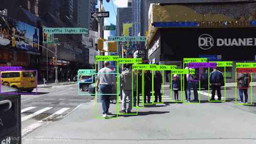

# 7주차: 딥러닝 맛보기

### 딥러닝이란?
함수 $f(X) = Y$ 관계에 있는 $X$ 와 $Y$ 에 대해, $X$ 를 입력받아 $Y$ 를 출력하는 함수 $f$ 를 구하고 싶다. 이 때 대규모 ${X, Y}$ 데이터 쌍들을 통해 다층 인공신경망 모델을 학습시킴으로써 $f$ 를 근사할 수 있는 함수 $\hat{f}$ 를 얻어내는 기계학습 방법론의 기법을 딥러닝이라고 한다.
- 함수 $f(X) = Y$: 특정한 형식의 $x$ 를 입력받아, 특정한 형식의 $y$ 를 출력하는 함수.
    - e.g. 이미지를 입력받아, 이미지 내 사람의 위치 좌표를 출력한다.
    - e.g. 사람의 이미지를 입력받아, 성별(1 혹은 0)을 출력한다.
    - e.g. 물체 이미지를 입력받아, 물체의 카테고리(사과, 오렌지, 핸드폰, ...)을 출력한다.
    - e.g. 숫자를 입력받아, 해당 숫자의 이미지를 출력한다.
    - **입력 데이터와 출력 데이터를 잘 정의하는 것이 훌륭한 딥러닝 프로젝트의 시작**
- 대규모 ${X, Y}$ 데이터 쌍: 무수히 많은 입력 데이터와 그에 대한 정답 데이터의 쌍을 모델(함수)에 학습시킴으로써 모델이 점차적으로 입력 데이터와 정답 데이터의 상관 관계를 파악할 수 있도록 한다. 1980년도에 고안되고 연구된 딥러닝이 2010년대 중반에 와서야 주목받게 된 이유.
- 인공신경망: 간단히 말해, 회귀분석 모델을 층층이 쌓아 아무리 복잡한 함수라도 근사적으로 표현해낼 수 있도록 한 함수 모델.
- 근사 함수 $\hat{f}$: 위와 같은 인공신경망 모델을 loss function - 모델의 출력값이 정답값과 얼마나 가까운지(다른지) 판단하는 함수 - 를 통해 학습시킴으로써 함수를 근사한다.
- 기계학습: 데이터를 학습시킴으로써 컴퓨터가 원하는 함수를 근사하도록 하는 방법론. 기계학습 방법론에는 회귀분석, decision tree, K-means clustering, support vector machine과 같은 방법들이 존재하고, 딥러닝은 이러한 기계학습 방법론 중 하나의 기법임.

### 딥러닝의 분야
- Natural Language Processing (자연어 처리): 챗봇
- Reinforcement Learning (강화 학습): 알파고
- **Computer Vision (컴퓨터 비전): 자율 주행**

### 딥러닝 제품 예시
- TBA

### 인공신경망 구조
- model: 모델의 구조를 정의해야 한다. 한 마디로 회귀분석 모델을 얼마나 두껍게, 얼마나 깊게 쌓을 것인지.
- data & data loader: 데이터를 저장하고, 이 데이터를 모델에 쉽고 편하게 입력하기 위한 클래스를 정의해야 한다.
- loss funcition: 모델의 출력값과 정답값을 비교하기 위한 함수를 정의해야 한다.
- optimizer: 계산된 loss function으로 모델을 학습(업데이트)하기 위한 방법을 정의해야 한다.

### 딥러닝 찍먹하기
- Google Colab: [링크](https://colab.research.google.com/)
- CIFAR10 classification model: [링크](https://colab.research.google.com/drive/1DORPApHQZ8ciI2HRxhZ2dHlM2thludvn)
- MNIST GAN: [링크](https://colab.research.google.com/drive/1E0NOoES7PscZ0l1uWgXMEvyBld5p9tGB)

---
*E.O.D.*